# One Touch, For the millions watching you.

## Mobile App for the Social Advertising Platform

## About The Project

One Touch is social advertising manager. This repository contains the UI of the application that is built using React Native CLI.

## App UI ScreenShots

<p align="center">

<a>
    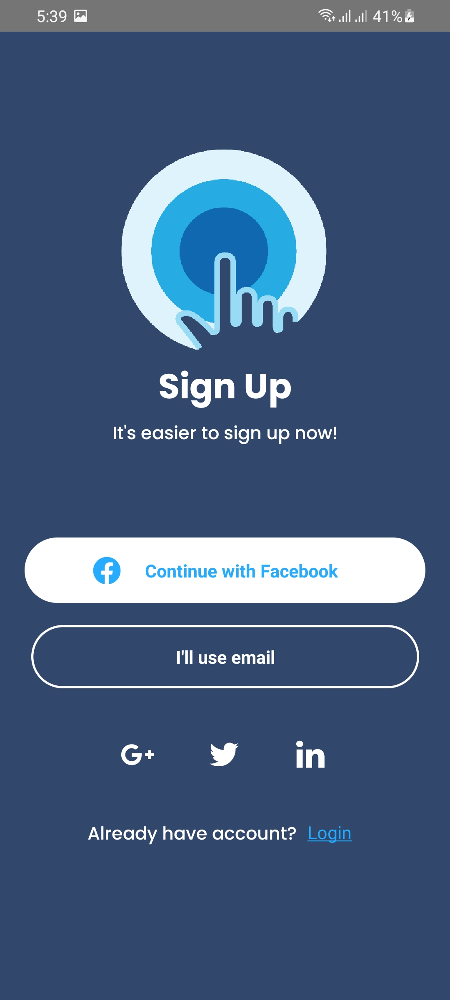
    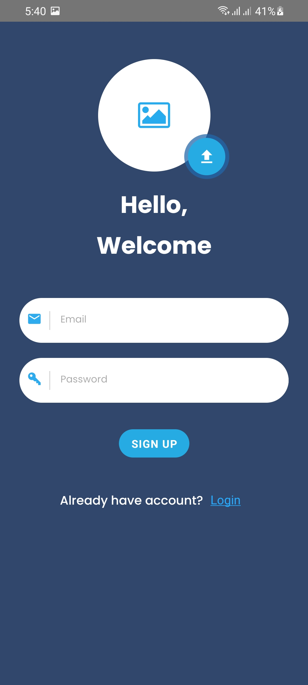
    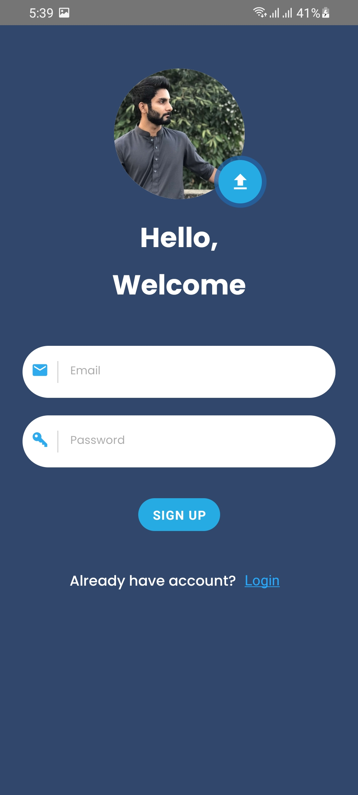
    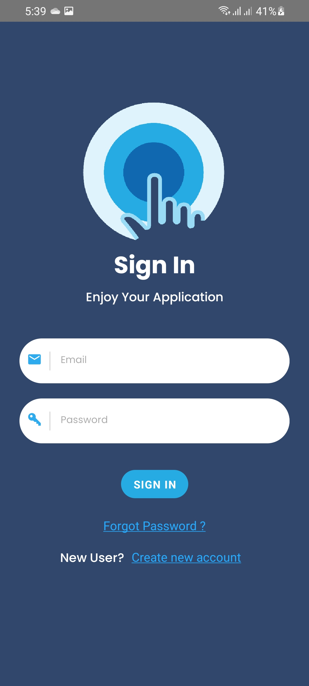
    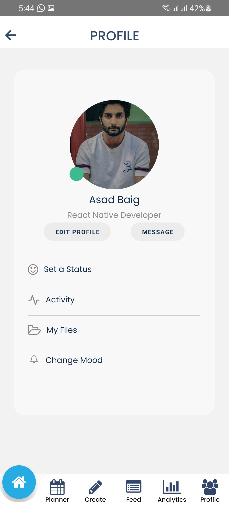
    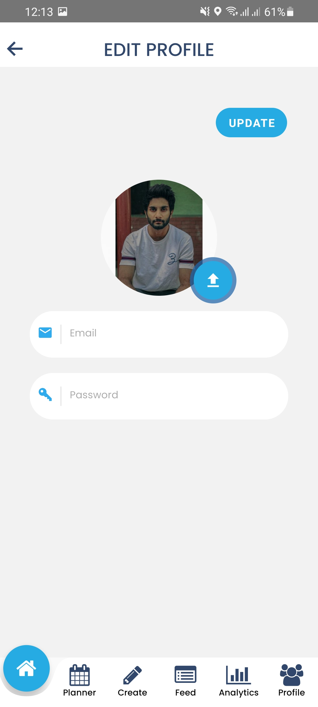
    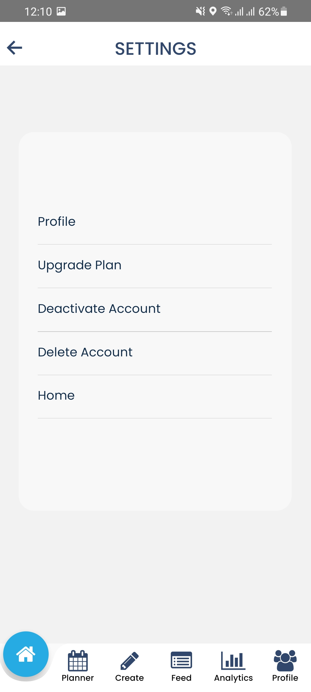
    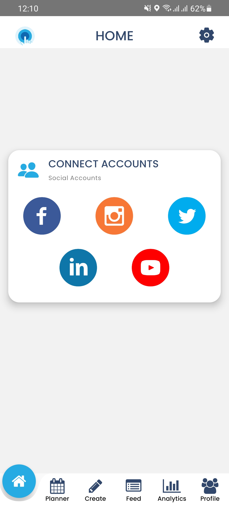
    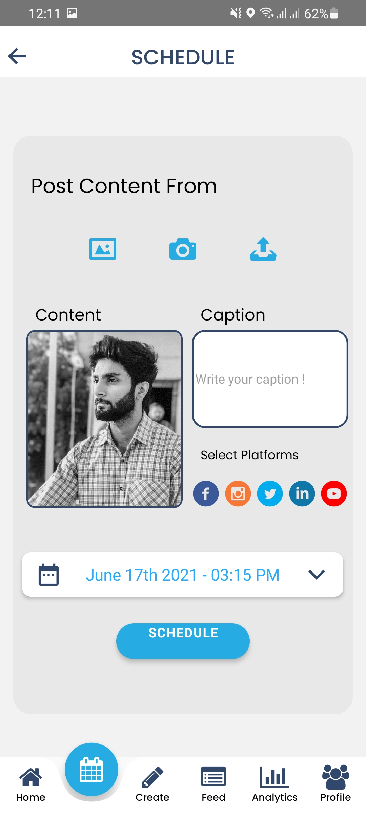
    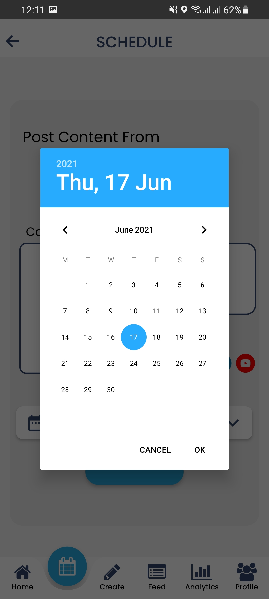
    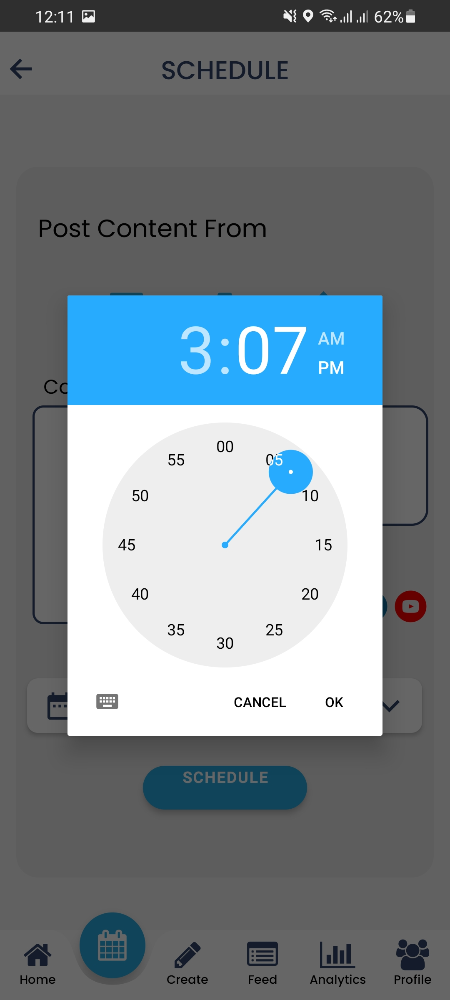
    
    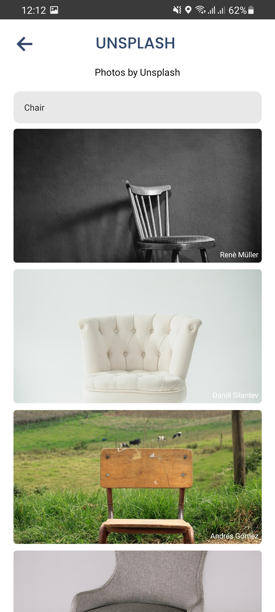
    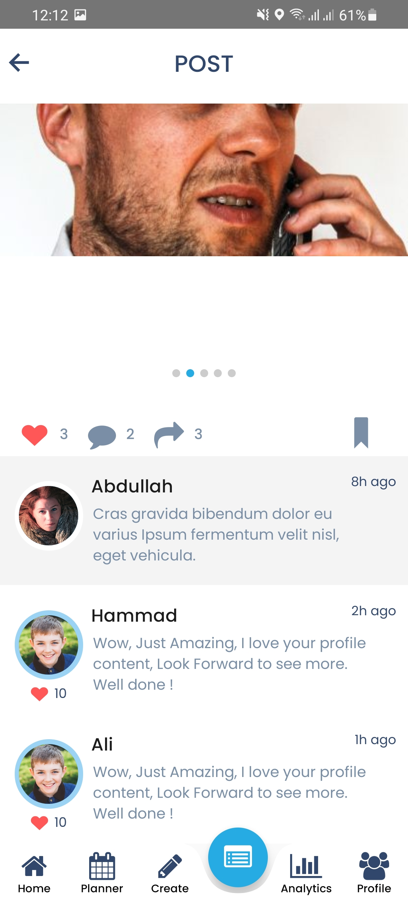
    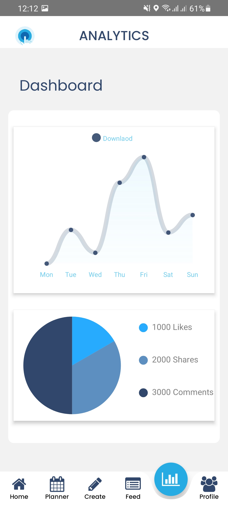
    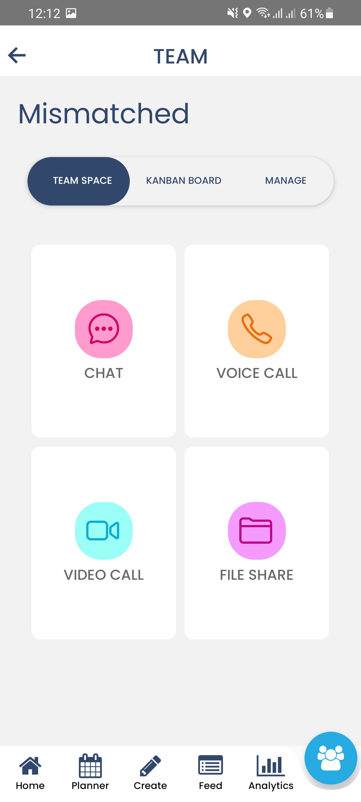
    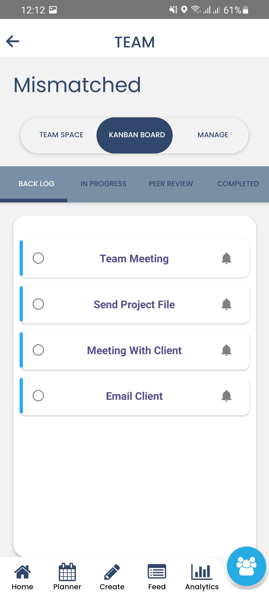
    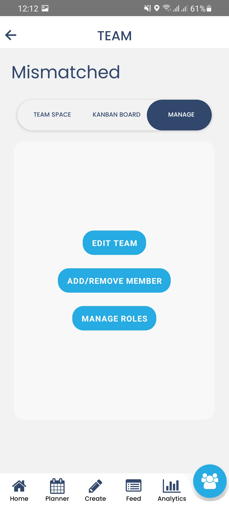
    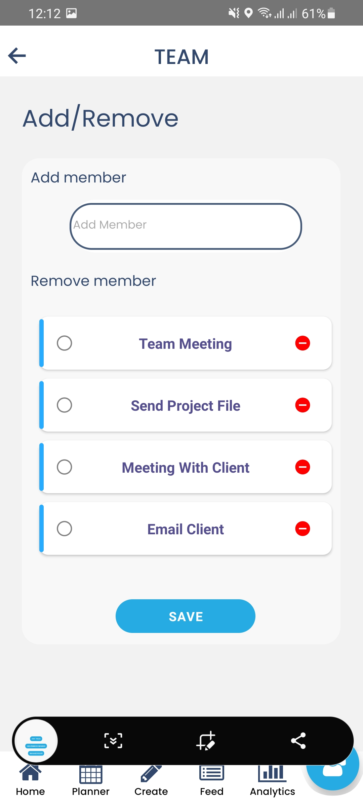
    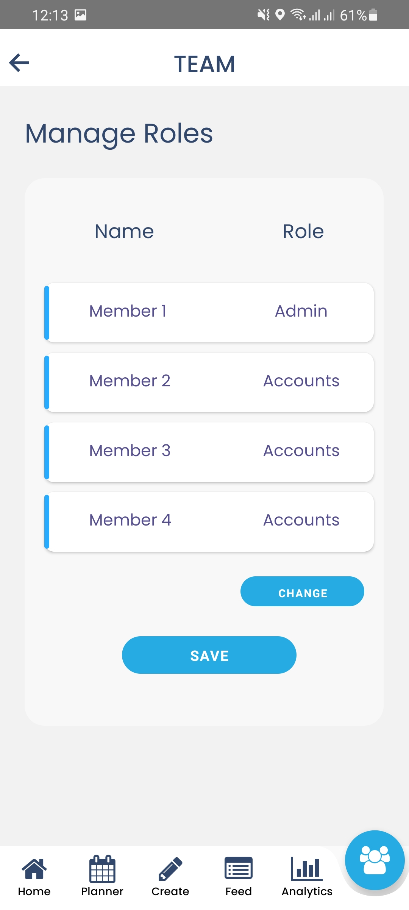
    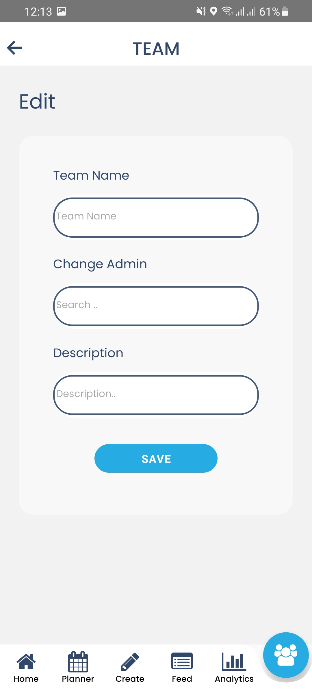

</a>
</p>

### Installation

1. Clone the repo
   ```sh
   git clone https://github.com/AsadBaig039/OneTouch.git
   ```
2. Install NPM packages

   ```sh
   npm install
   ```

### Run Application

1. Open VSCode Terminal
2. Run the Command
   ```sh
   react-native run-android
   ```

## Contact

ASAD BAIG - [asad.baig039@gmail.com](asad.baig039@gmail.com)

Project Link: [https://github.com/AsadBaig039/OneTouch.git](https://github.com/AsadBaig039/OneTouch.git)

<!-- ACKNOWLEDGEMENTS -->

## Acknowledgements

- [Vector Icons](https://www.npmjs.com/package/react-native-vector-icons)
- [Cloudinary](https://cloudinary.com/home-6-4-video-b)
- [Formik](https://www.npmjs.com/package/react-native-formik)
- [Yup](https://www.npmjs.com/package/yup)
- [Location](https://docs.expo.io/versions/latest/sdk/location/)
- [Lottie](https://lottiefiles.com/)
- [Progress](https://www.npmjs.com/package/expo-progress)
